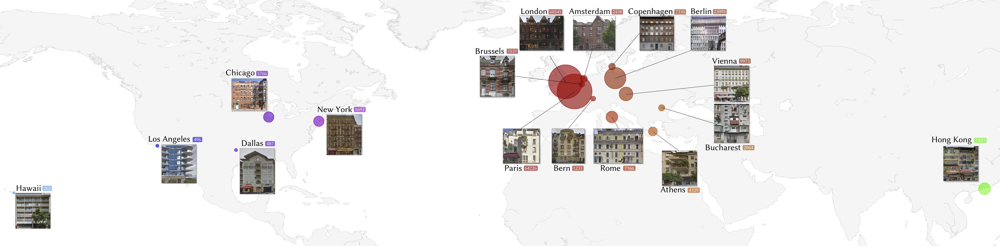

## Large Scale Architectural Asset Dataset -- LSAA (TVCG)


Large Scale Architectural Asset Dataset (LSAA) is  a dataset of architectural assets from a large-scale panoramic image collection:

> **Large Scale Architectural Asset Extraction from Panoramic Imagery**<br>
> Peihao Zhu (KAUST), Wamiq Reyaz Para (KAUST), Anna Fruehstueck (KAUST), John Femiani (Miami University in Oxford Ohio), Peter Wonka (KAUST)<br>
> https://youtu.be/XmQvwaIbbKE
> https://ieeexplore.ieee.org/document/9145640

The dataset consists of 78,377 photospheres and 199,723 extracted facade images including the contained windows, doors, and balconies together with descriptive attributes.

For inquiries, please contact peihao.zhu@kaust.edu.sa

## Licenses
The dataset (including JSON, CSV metadata, download script, and documents) is made available under [Creative Commons BY-NC-SA 4.0](https://creativecommons.org/licenses/by-nc-sa/4.0/). You can **use, redistribute, and adapt it for non-commercial purposes**, as long as you (a) give appropriate credit by **citing our paper**, (b) **indicate any changes** that you've made, and (c) distribute any derivative works **under the same license**.

* [https://creativecommons.org/licenses/by-nc-sa/4.0/](https://creativecommons.org/licenses/by-nc-sa/4.0/)


## <span style="color:red"> New Update</span>

The architectural asset dataset can be directly downloaded [Here](https://drive.google.com/drive/folders/1iRZ9lw9vsiQbDGYMGK-II5g7yK_9Gw8d?usp=sharing), and the panorama rectification code has been added to the `Panorama_Rectification/` folder.

To rectify the panorama images input by the user, put them in the `Panorama_Rectification/Pano_new/New/images` folder and run

```
cd Panorama_Rectification
python Batch_Simon_Panoramas_final.py
```


## Overview


This dataset contains 199,723 facade images and corresponding window, door, and balcony asset images together with descriptive attributes. You can also get the original panoramic images (b) and projected images (c) after running the download scripts.

Geographic locations of the collected facades:


To get all of the data, you first need to download the annotations folder from [Google Drive](https://drive.google.com/open?id=1hnMSMuA4fY28rqkI64asGmhUWKg_OMc5) and place it under the main lsaa-dataset folder.

The following is a list of the contents of the annotations folder:

| Path | Size | Files | Format | Description
| :--- | :--: | ----: | :----: | :----------
| [annotations](https://drive.google.com/open?id=1hnMSMuA4fY28rqkI64asGmhUWKg_OMc5) | 860.2 MB | 13 | | Annotations folder
| &boxvr;&nbsp; [Properties200K.csv](https://drive.google.com/open?id=1XR5CNsQGg9803yJ_YYtcchgZlXizv_gx) | 77.1 MB | 1 | CSV | Properties file of 200K facades
| &boxvr;&nbsp; [Properties23K.csv](https://drive.google.com/open?id=1ghPJjIHrao77-T8tvTlVn9cp9cKhZeLf) | 9.2 MB | 1 | CSV | Filtered version of Properties200K.csv (a subset of 23K facades)
| &boxvr;&nbsp; [panorama_rectification.json](https://drive.google.com/open?id=12cOD19PeknR8uD7ePpJ74fOkVszQnj0G) | 138.6 MB | 1 | JSON | Rectification parameters of the panoramic images
| &boxvr;&nbsp; [facade_detection_result.json](https://drive.google.com/open?id=195uDy_l3dWbX8kVepHkcnpfKbq4ChiGF) | 85.2 MB | 1 | JSON | Facade bounding boxes on projected images
| &boxvr;&nbsp; [window](https://drive.google.com/open?id=1AAp8TrHhAHvjHC6_XXQtiMNtmE9rVyoa) | 419.1MB | 3 | | Annotations folder of windows
| &boxv;&nbsp; &boxvr;&nbsp; [window_all.csv](https://drive.google.com/open?id=1ZzU1K6J-V4fA1lFJQZvHxs1pAgeGvDzJ) | 147.0MB | 1 | CSV | Properties file of windows
| &boxv;&nbsp; &boxvr;&nbsp; [window_filtered.csv](https://drive.google.com/open?id=1B9VRjIjmjwinWSCtdasHkN5cIg5dr4Dd) | 44.4 MB | 1 | CSV | Filtered version of window_all.csv
| &boxv;&nbsp; &boxur;&nbsp; [window_detection.json](https://drive.google.com/open?id=17BVv-83BZrKj6rMe8FJyzTBiI58sE35e) | 227.7 MB | 1 | JSON | Window bounding boxes on the 23K facades
| &boxvr;&nbsp; [door](https://drive.google.com/open?id=1Rojo5dhgLejOhznrHijUcnMcFqKofEeK) | 23.1MB | 3 | | Annotations folder of doors
| &boxv;&nbsp; &boxvr;&nbsp; [door_all.csv](https://drive.google.com/open?id=1pVBiEmKPDelo_ThiSMTeWgqOwUzcIyRL) | 8.0MB | 1 | CSV | Properties file of doors
| &boxv;&nbsp; &boxvr;&nbsp; [door_filtered.csv](https://drive.google.com/open?id=102pCJ9VczUHMfOGPXOhbMnql6KJ19paL) | 5.0 MB | 1 | CSV | Filtered version of door_all.csv
| &boxv;&nbsp; &boxur;&nbsp; [door_detection.json](https://drive.google.com/open?id=1S48sCwfWYHX6-XkhMAvtkdRrNXJMA_xc) | 10.2 MB | 1 | JSON | Door bounding boxes on the 23K facades
| &boxur;&nbsp; [balcony](https://drive.google.com/open?id=13qt-1BPgDp7WBJFs9YCDWHTcZGtX2mXL) | 107.8MB | 3 | | Annotations folder of balconies
| &ensp;&ensp; &boxvr;&nbsp; [balcony_all.csv](https://drive.google.com/open?id=1TqoKAbbriRoKrdm2I6ODk5MUfcmMtFw9)| 40.7MB | 1 | CSV | Properties file of balconies
| &ensp;&ensp; &boxvr;&nbsp; [balcony_filtered.csv](https://drive.google.com/open?id=1aTpfpy7Nii3x8il4ieiBzZrI2fjgYkav)| 15.2MB | 1 | CSV | Filtered version of balcony_all.csv
| &ensp;&ensp; &boxur;&nbsp; [balcony_detection.json](https://drive.google.com/open?id=1ymygF05ZbiJ4faMJQqDODZDefFVX-HjI) | 51.9 MB | 1 | JSON | Balcony bounding boxes on the 23K facades


## Installation
Clone this repo.

```
git clone git@github.com:ZPdesu/lsaa-dataset.git
cd lsaa-dataset
```
Please install dependencies by

```
pip install -r requirements.txt
```
This code also requires the [google-panorama-by-id](https://www.npmjs.com/package/google-panorama-by-id) to check whether the panorama has been removed by Google. You can easily install it by

```
npm install google-panorama-by-id
```
Then put the previously downloaded [annotations](https://drive.google.com/open?id=1hnMSMuA4fY28rqkI64asGmhUWKg_OMc5) folder in the current directory.

## Download script

To download the data, you can easily use the provided download scripts. Please use these 4 scripts according to the order from step1 to step4, and make sure that the optional arguments for step1 to step3 are the same.

**Step1**: Download the panoramic images.

```
> python step1_download_panoramas.py -h
usage: step1_download_panoramas.py [-h] [--properties_file FILE] [--cores NUM]
                                   [--pano_folder FOLDER]
                                   [--projection_folder FOLDER]
                                   [--facade_folder FOLDER]
                                   [--facade_detection_result FILE]
                                   [--panorama_rectification FILE]
                                   [--country COUNTRY] [--city CITY]
                                   [--min_height PX] [--min_width PX]
                                   [--max_height PX] [--max_width PX]
                                   [--max_occlusion NUM] [--first NUM]
                                   [--last NUM] [--use_tqdm BOOL]
​
```
**Step2**: Rectify and project the panoramic images.

```
> python step2_rectify_and_project_panoramas.py -h
usage: step1_download_panoramas.py [-h] [--properties_file FILE] [--cores NUM]
                                   [--pano_folder FOLDER]
                                   [--projection_folder FOLDER]
                                   [--facade_folder FOLDER]
                                   [--facade_detection_result FILE]
                                   [--panorama_rectification FILE]
                                   [--country COUNTRY] [--city CITY]
                                   [--min_height PX] [--min_width PX]
                                   [--max_height PX] [--max_width PX]
                                   [--max_occlusion NUM] [--first NUM]
                                   [--last NUM] [--use_tqdm BOOL]
​
```
**Step3**: Detect facades from projected images.

```
> python step3_detect_facades_from_rendering.py -h
usage: step1_download_panoramas.py [-h] [--properties_file FILE] [--cores NUM]
                                   [--pano_folder FOLDER]
                                   [--projection_folder FOLDER]
                                   [--facade_folder FOLDER]
                                   [--facade_detection_result FILE]
                                   [--panorama_rectification FILE]
                                   [--country COUNTRY] [--city CITY]
                                   [--min_height PX] [--min_width PX]
                                   [--max_height PX] [--max_width PX]
                                   [--max_occlusion NUM] [--first NUM]
                                   [--last NUM] [--use_tqdm BOOL]
​
```

Optional arguments for step1,2,3:

```
  -h, --help            show this help message and exit
  --properties_file FILE
                        facade_properties file (default:
                        annotations/Properties23K.csv)
  --cores NUM           use multiple cores to download panoramas (default: 48)
  --pano_folder FOLDER  panorama folder (default: data/Panoramas)
  --projection_folder FOLDER
                        projection folder (default: data/Projection)
  --facade_folder FOLDER
                        facade folder (default: data/Facades)
  --facade_detection_result FILE
                        facade bounding boxes on projected images (default:
                        annotations/facade_detection_result.json)
  --panorama_rectification FILE
                        rectification parameters of the panoramic images
                        (default: annotations/panorama_rectification.json)
  --country COUNTRY     country constrain (default: None)
  --city CITY           city constrain (default: Vienna)
  --min_height PX       facade minimal height (default: None)
  --min_width PX        facade minimal width (default: None)
  --max_height PX       facade maximal height (default: None)
  --max_width PX        facade maximal width (default: None)
  --max_occlusion NUM   facade max occlusion (default: 0.6)
  --first NUM           first facade number (default: 0)
  --last NUM            last facade number (default: 50)
  --use_tqdm BOOL       use tqdm (default: True)
```

Here is an example to download 300 facade images of Vienna with a minimum pixel size greater than 200&times;200.

```
> python step1_download_panoramas.py --city Vienna --min_height 200 --min_width 200 --first 0 --last 300
> python step2_rectify_and_project_panoramas.py --city Vienna --min_height 200 --min_width 200 --first 0 --last 300
> python step3_detect_facades_from_rendering.py --city Vienna --min_height 200 --min_width 200 --first 0 --last 300
```

It is worth noting that three files need the same optional arguments. If you want to change the default values, please modify the `options/facade_base_options.py`.

By default, we use the `annotations/Properties23K.csv` as facade_properties file, which means we only download the filtered 23K facade images other than the original 200K. Due to image quality issues, we removed facade images of Berlin, Brussels and HK in the `annotations/Properties23K.csv`, so please do not choose these values as the city option when you are using the `annotations/Properties23K.csv`.

**Step4**: Detect architectural assets (windows, doors and balconies) from downloaded facade images.

```
> python step4_detect_assets_from_facades.py -h
usage: step4_detect_assets_from_facades.py [-h] [--asset_type TYPE]
                                           [--filtered BOOL] [--cores CORES]
                                           [--pano_folder FOLDER]
                                           [--projection_folder FOLDER]
                                           [--facade_folder FOLDER]
                                           [--country COUNTRY] [--city CITY]
                                           [--min_height PX] [--min_width PX]
                                           [--max_height PX] [--max_width PX]
                                           [--max_occlusion NUM]
                                           [--use_tqdm BOOL]
​
optional arguments:
  -h, --help            show this help message and exit
  --asset_type TYPE     asset type (default: window)
  --filtered BOOL       if filtered use asset_filtered.csv, otherwise use
                        asset_all.csv (default: True)
  --cores CORES         use multiple cores to download panoramas (default: 48)
  --pano_folder FOLDER  pano folder (default: data/Panoramas)
  --projection_folder FOLDER
                        projection folder (default: data/Projection)
  --facade_folder FOLDER
                        facade folder (default: data/Facades)
  --country COUNTRY     country constrain (default: None)
  --city CITY           city constrain (default: None)
  --min_height PX       asset minimal height (default: None)
  --min_width PX        asset minimal width (default: None)
  --max_height PX       asset maximal height (default: None)
  --max_width PX        asset maximal width (default: None)
  --max_occlusion NUM   max occlusion (default: None)
  --use_tqdm BOOL       use tqdm (default: True)
​
```

Depending on the asset types selected, you can get different kind of architectural assets from previously downloaded facade images, e.g. windows or doors. Here is a simple example to get the window images:

```
> python step4_detect_assets_from_facades.py --asset_type window
```
There are also two versions of the assets properties file: `xx_all.csv` and `xx_filtered.csv`. By default we use `xx_filtered.csv`, so if you want to use `xx_all.csv`, please add `--filtered False` option. Both of assets in `xx_all.csv` and `xx_filtered.csv` are obtained from the facades in `Properties23K.csv`.

Example to get all of the door images:

```
> python step4_detect_assets_from_facades.py --asset_type door --filtered False
```
**Note**:
Since Google deleted some of the panoramas recorded in our files, the final downloaded facades and other architectural aseets may be less than expected. Please check the download results in the `data` folder and logs in the `logs` folder.

When the program starts working, the terminal will print `start`, and print `finished` when it is done.


## Metadata
### Facades

The `Properties23K.csv` and `Properties200K.csv` contains the following properties information for each facade image: 

|name   |panoID   |country   |city   |building   |Lon   |Lat   |height   |width   |resolution   |aspect_ratio   |noblur   |view_angle   |Homography_error   |floors   |num_windows|background   |deco   |window|balcony   |shop   |sign   |tree   |obs   |total_occlusion|
|---|---|---|---|---|---|---|---|---|---|---|---|---|---|---|---|---|---|---|---|---|---|---|---|---|
|USA_NewYork_way264624874_Fid5411_-C0oUsgY_kUIty96ZOtrWg.jpg   | -C0oUsgY_kUIty96ZOtrWg   |USA   |NewYork   |way264624874   |-74.00   |40.74   |843   |787   |663441   |1.07   |2989.11   |49.97   |0.01   |7|50|0.14   |0   |0.10   |0   |0   |0   |0.26   |0.01   |0.27   |
|...|...|...|...|...|...|...|...|...|...|...|...|...|...|...|...|...|...|...|...|...|...|...|...|...|


The `facade_detection_result.json` contains the following bounding box information for each facade image: 
```
{
	'USA_NewYork_way264624874_Fid5411_-C0oUsgY_kUIty96ZOtrWg.jpg':{
        'complete_name': 'USA_NewYork_way264624874_wall_1_1_-C0oUsgY_kUIty96ZOtrWg_VP_0_1.jpg', 
        'simplified_name': '-C0oUsgY_kUIty96ZOtrWg_VP_0_1.jpg', 
        'panoID': '-C0oUsgY_kUIty96ZOtrWg', 
        'box': [2351.682861328125, 1545.7784423828125, 787.02587890625, 842.2864990234375]
        },
	...
}
```

The `panorama_rectification.json` contains the following rectification information for each projected image: 
```
{
	'USA_NewYork_way264624874_wall_1_1_-C0oUsgY_kUIty96ZOtrWg_VP_0_1.jpg':{
    	'pano_img': 'way264624874_wall_1_1_-C0oUsgY_kUIty96ZOtrWg.jpg', 
        'panoID': '-C0oUsgY_kUIty96ZOtrWg', 
        'simplified_name': '-C0oUsgY_kUIty96ZOtrWg_VP_0_1.jpg', 
        'country': 'USA', 
        'city': 'NewYork', 
        'pitch': 0.01951806432130453, 
        'roll': -0.0023856889244242277, 
        'heading': -4.70347914765424, 
        'height': 6656, 
        'width': 13312}
	...
}
```

### Assets

The `xx/xx_filtered.csv` and `xx/xx_all.csv` (xx refers to a specific asset type e.g. window) contains the following properties information for each asset image: 

|name   |panoID   |country   |city   |building   |height   |width   |resolution   |aspect_ratio   |noblur   |view_angle  |facade_name   |normalized_x   |normalized_y   |
|---|---|---|---|---|---|---|---|---|---|---|---|---|---|
|France_Paris_way49339544_Fid485_Wid294383_ZgdOAZkrWUQAYh7Lk5rmvA.jpg   |ZgdOAZkrWUQAYh7Lk5rmvA   |France   |Paris   |way49339544   |123   |54   |6642   |2.28   |891.91   |41.12   |France_Paris_way49339544_Fid485_ZgdOAZkrWUQAYh7Lk5rmvA.jpg   |0.23   |0.53   |
|...|...|...|...|...|...|...|...|...|...|...|...|...|...|


The `xx/xx_detection.json` contains the following bounding box information for each asset image: 
```
{
	'France_Paris_way49339544_Fid485_Wid294383_ZgdOAZkrWUQAYh7Lk5rmvA.jpg':{
    	'facade_name': 'France_Paris_way49339544_Fid485_ZgdOAZkrWUQAYh7Lk5rmvA.jpg', 
        'panoID': 'ZgdOAZkrWUQAYh7Lk5rmvA', 
        'box': [159.14720153808594, 436.5448303222656, 44.50091552734375, 102.63150024414062]
        },
	...
}
```

## Citation

If you use this code or data for your research, please cite our papers.

```
@ARTICLE{9145640,
  author={P. {Zhu} and W. R. {Para} and A. {Fruehstueck} and J. {Femiani} and P. {Wonka}},
  journal={IEEE Transactions on Visualization and Computer Graphics}, 
  title={Large Scale Architectural Asset Extraction from Panoramic Imagery}, 
  year={2020},
  volume={},
  number={},
  pages={1-1},}
```

## Acknowledgements
The self-contained streetview codes are modified from https://github.com/robolyst/streetview
